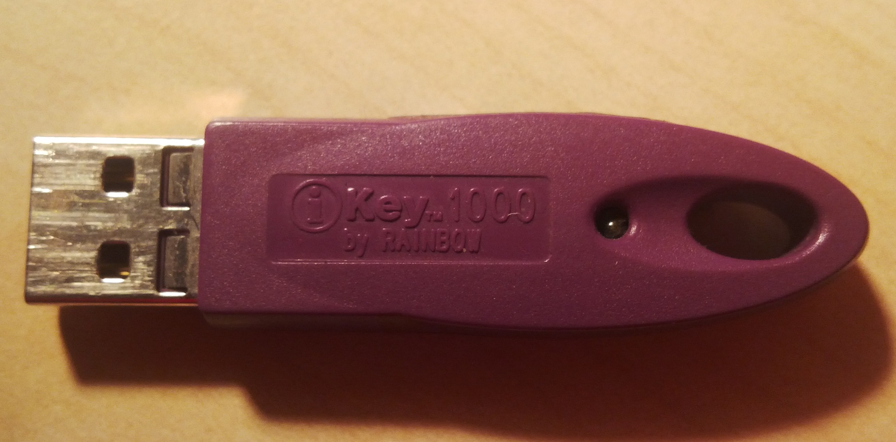
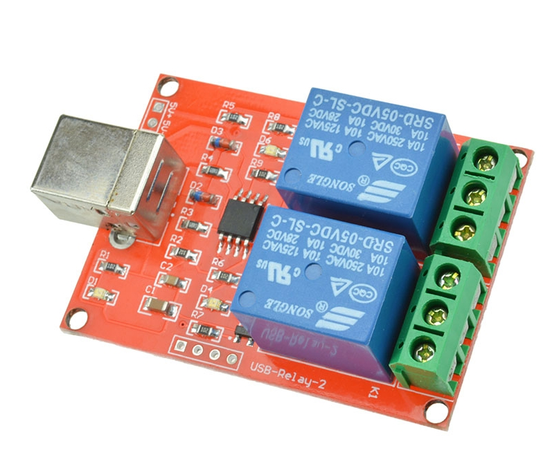
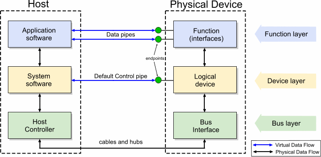
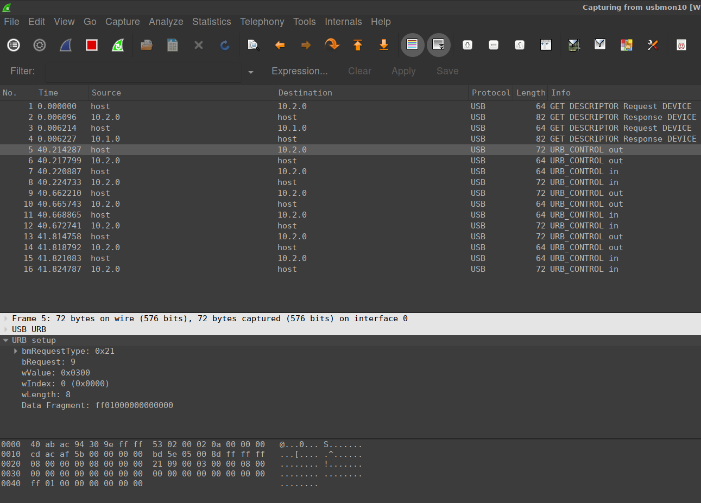

% Reverse engineering i userspace driver prostego urządzenia USB 
% Michał Słomkowski

# Wprowadzenie

## Po co?

* nietypowe urządzenie USB
* działa pod Windows, ma program 

## Przykład: iKey1000

## Myszka SteelSeries Sensei

## Moduł przekaźników

# USB - podstawy

## Ogólnie

* *Universal Serial Bus*,
* fizycznie: para różnicowa (skrętka), USB 3.0 - 3 pary,
* do 127 urządzeń (z hubami) w drzewie,
* wersje:
    * *low speed* - 1.5 Mbit/s, *high speed* - 12 Mbit/s
    * 2.0 - *high speed* - 480 Mbit/s
    * 3.0 *super speed* - 5 Gbit/s
* zasilanie urządzenia z hosta

## Architektura

## Endpointy i typy transferów

>Endpoint - logiczne gniazdo komunikacyjne. Posiada numer i typ.

Typy transferów:

* kontrolny (control) - małe porcje danych, real-time, kontrola poprawności,
* przerwaniowy (interrupt) - jw,
* masowy (bulk) - dużo danych, brak gwarantowanego pasma, kontrola poprawności,
* izochroniczny (isochronous) - dużo danych, real-time, gwarantowane pasmo, brak kontroli poprawności.

## Klasy USB

Przykłady klas USB:

* CDC - urządzenia komunikacyjne np. modemy, konwertery USB-RS232 lub LPT,
* mass storage - dyski,
* audio,
* hub,
* HID - Human Interface Device. Np. myszki, klawiatury, joystick, różne nietypowe.

## Deskryptory

>Deskryptory zawierają informacje o danym podsystemie. Mają postać tablicy bajtów.

* Device Descriptors - klasa, vendor ID, product ID, 
* Configuration Descriptors - parametry elektryczne,
* Interface Descriptors - liczba endpointów, 
* Endpoint Descriptors - typ transferu, 
* String Descriptors - obsługiwane języki, nazwa producenta, produktu itd.

## Vendor ID i product ID

* Vendor ID - identyfikator producenta,
* Product ID - identyfikator produktu,
* nadaje *usb.org* po certyfikacji,
* koszt ok. 5000 dolarów.

# Idea reverse engineering-u

* Windows 10 pod VirtualBox
* fizyczne urządzenie podłączone do VirtualBox
* moduł jądra `usbmon`
* obserwacja pakietów w WireShark

## Biblioteki do USB pod Pythonem

* **pyusb**
* *hidraw*
* *hidraw-pure*

# Live demo

## Plan:

* podłączenie urządzenia,
* wykrycie w systemie i pokazanie deskryptorów USB,
* reguła *udev*, by nie ładować sterownika i mieć uprawnienia ze zwykłego usera
* otwarcie urządzenia pod *pyusb* 

* załadowanie modułu `usbmon`
* podłączenie do VirtualBox-a
* włączenie Wireshark-a
* filtrowanie po numerze urządzenia

## Struktura pakietu z transferu kontrolnego

* `bmRequestType`
* `bmRequest`
* `wValue`
* `wIndex`
* data fragment

# Podsumowanie

## Czego nie ma sensu robić tą metodą?

* urządzenia, które są czymś powszechnie używanym 
* urządzenia, które implementują wirtualny port szeregowy

## Co zapamiętać z prezentacji?

* VirtualBox umożliwia podłączenie fizycznego urządzenia USB
* pakiety USB można podsłuchiwać Wireshark-iem
* są high-level biblioteki do obsługi USB dla popularnych języków

## Kontakt

Michał Słomkowski

Strona internetowa: [slomkowski.eu](https://slomkowski.eu). Jest tam kontakt.

